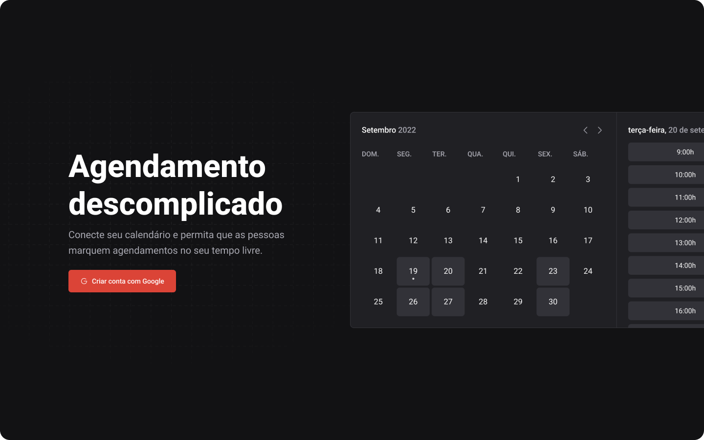

<h4 align="center">
  
</h4>

<h4 align="center">
    <p align="center">
      <a href="#-about">About</a>&nbsp;&nbsp;&nbsp;|&nbsp;&nbsp;&nbsp;
      <a href="#-technologies">Technologies</a>&nbsp;&nbsp;&nbsp;|&nbsp;&nbsp;&nbsp;
      <a href="#-how-to-run-the-project">Run</a>&nbsp;&nbsp;&nbsp;|&nbsp;&nbsp;&nbsp;
      <a href="#-info">Info</a>&nbsp;&nbsp;&nbsp;|&nbsp;&nbsp;&nbsp;
      <a href="#-license">License</a>
  </p>
</h4>

<h1 align="center">
  
</h1>

## 🔖 About

O **ignite-call** é um projeto que facilita a organização da agenda, nesse projeto é possível:

- Criar uma conta através do social login do google
- Definir quais horários disponíveis
- Disponibiliza link social para outras pessoas marcarem horários na agenda
- Integração com a agenda do Google


O layout está disponível no [Figma](https://www.figma.com/community/file/1161274296921389678)

## 🚀 Technologies

- [NextJS](https://nextjs.org/)
- [TypeScript](https://www.typescriptlang.org/)
- [ReactHookForm](https://react-hook-form.com/)

## 🏁 How to run the project

```bash
# Clone the repository
git clone https://github.com/rafinhaa/ignite-call.git
cd design-system

# Install the dependencies
npm install

# Make a copy of '.env.local.example' to '.env.local'
cp .env.local.example .env.local


# Start the application
npm run dev
```

## ℹ️ Info

## 📝 License

[MIT](https://choosealicense.com/licenses/mit/)

**Free Software, Hell Yeah!**